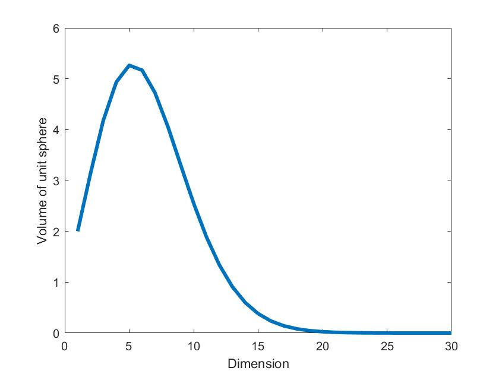

## Framework of statistical learning
[TOC]

The word "learning" in statistical learning means to extract certain pattern of data based on finite samples, and "statistical" refers to statistical tools we are going to use. One of the main goals of statistical learning is to build a predictor from given data. Concretely, let $(X,Y):\Omega\to (\mathbb{R}^d,\mathbb{R})$ be a pair of randome variables with unknown distribution, and how can we broadcast the 'best' prediction of $Y$, denoted by $\hat{Y}=f(X)$, given any realization $X=x$? If the data generaing distribution $P_{X,Y}$ is known, then the problem is trivial.  But in practice there may not exist a proper distribution model for $(X,Y)$, and we can only build our prediction based on limited data drawn from the distribution. This main problem leads to three key components in statistical learning:

* *Model*: What kind of functions we are going to use for prediction. It is usually called **hypothesis space**, denoted by $\mathbb{F}=\{f:\mathbb{R^d}\to\mathbb{R}|\text{functions we would like to use}\}$
* *Strategy*: How we evaluate our prediction. Given two predictors, how do we compare them? Usually we will define a **evaluation function** $R:\mathbb{F}\to\mathbb{R}$ and we compare their 'scores'. Then it becomes a optimization problem that we aim to find the best predictor with highest score.
* *Algorithm*: How we find the best predictor, namely how to solve the optimization problem.

These three concepts will be the main content we are going to focus on. We will begin with the general idea, and dive into them later.

### Loss function, risk and risk minimizer
Let us forget about model selection problem for a while and focus on the strategy (evaluation problem). In general the evaluation function we will use is to supposed to measure the 'distance' (sort of )between $Y$ and our prediction $f(X)$, namely  a metric on $Y$ based on predictor $f$. Given instances, we can define **loss function** (or cost function) as a penalty on prediction error given $X=x, Y=y$ :
$$L:(\mathbb{R},\mathbb{R})\to \mathbb{R}.$$  
>[**Examples** (*L1 and L2 loss*)] ones that we will frequenctly encounter are $L_2$ loss and $L_1$ loss.
$$L_2(y,f(x))\triangleq (y-f(x))^2,$$ $$L_1(y,f(x))\triangleq |y-f(x)|.$$

Then we can evaluate a predictor by its expect loss, called **risk**, defined by 
$$R(f)\triangleq E[L(Y,f(X))],$$ where $X,Y$ are random variables drawn from certain unknown distribution. Basically, the risk says how many loss you are expected to get from a random data. Our strategy of choosing best predictor is to find the **risk minimizer** (RM) $f^*$:
$$f^* \triangleq \arg\min_{f\in F}R(f).$$ $f^*$ is the best predictor theoretically. Some examples below show common RM.
>[**RM of L2 loss**] If consider $L_2$ loss, then the RM is the posterior expectation $$f^*(X)=E(Y|X).$$
>[**Proof**] By definition we have$$f^*=\arg\min_{f\in F}E(Y-f(X))^2.$$ By conditioning on $X$, we find 
>$$f^*=\arg\min_{f\in F}EE[(Y-f(X))^2|X].$$ We can piecewisely minimize the risk by defining 
>$$f^*(X)=\arg\min_{c}E[(Y-c)^2|X].$$ Then we easily figure out that $f^*(X)=E(Y|X)$, with optimal risk $R(f^*)=Var(Y)$.

>[**RM of L1 loss**] If we take $L_1$ loss, then the RM is 
>$$f^*(X)=\text{Median}(Y|X).$$
>[**Proof**] By definition of RM, 
>$$f^*=\arg\min_{f}E|Y-f(X)|,$$ and by conditioning on $X$, we can piecewisely optimize it and find
>$$f^*(X)=\arg\min_{c}E(|Y-c||X).$$ For this unconstraint optimization problem, one can solve it by making the derivative zero:
>$$0=\frac{\partial}{\partial c}E(|Y-c||X)=\frac{\partial}{\partial c}\int_{-\infty}^{+\infty}|y-c|p(y)dy.$$ We can divide the integral into $y\le c$ and $y>c$ and as a result, we can show that
>$$\int_{-\infty}^{c^*}p(y)dy=\int_{c^*}^{+\infty}p(y)dy,$$ which suggests that $c^*=f^*(X)$ is the median of distribution $Y|X$.

### KNN method
Note that although we figure out the best predictor in L2 and L1 loss, we cannot directly get them since distribution $p_{X,Y}$ is unknown. A natural way is to gather data $\{(x_i,y_i)\}$ that drawn from $p_{X,Y}$ and estimate the RM. For instance, in L2 loss, the RM is the posterior expectation:
$$f^*(x)=E(Y|X=x).$$ A reasonable estimation based on data is 
$$\hat{f}^*(x)=\frac{\sum_i^N y_iI(x_i=x)}{\sum_i^NI(x_i=x)}=\frac{1}{N_x}\sum_{x_i=x}y_i,$$ where $I$ is the indicator. The estimation is an unbiased estimation since
$$E(\hat{f}^*(x))=E(\frac{1}{N_x}\sum_iY_iI(X_i=x))=EE(\frac{1}{N_x}\sum_iy_iI(x_i=x)|N_x)=E(\frac{1}{N_x}N_xE(Y|X=x))=E(Y|X=x).$$ So by law of large number, we expect to obtain the RM. 
One may notice that $X_i=x$ could be a extremely demanding condition in continuous distribution, so typically we will relax the equality constraint $x_i=x$, which turns out to be K-nearest neighbors method:
$$\hat{f}^*(x)\approx \frac{1}{k}\sum_{x_i\in N_k(x)}y_i,$$ where $N_k(x)$ is the k-nearest neighbors of $x$ under certain metric, or kernel method:
$$\hat{f}^*(x)\approx \frac{\sum_iy_iK(x_i,x)}{\sum_iK(x_i,x)},$$ where kernel function $K(x_i,x)$ represents contribution of sample $x_i$ to $x$. One may recognize that these are methods for non-parameter estimation. Since we do not make any assumption on distribution (namely, non-parameter estimation), our estimation of $E(Y|X)$ through data is equivalent to first estimate distribution $P_{X,Y}(x,y)$ and then calculate $E(Y|X)$ based on the estimated distribution. 

The story of statistical learing seems to end here, since we have a good method to estimate the RM, which is the best predictor for prediction problem. However, non-parameter estimation encounters a big challenge in high-dimensional space. To see the problem, consider the volume of k-dimension unit sphere,
$$V_k = \frac{\pi^{k/2}}{(k/2)!},$$ whose plot is shown below. We can see that as $k$ grows, the volume of a unit sphere shrinks quickly, which leads to bad locality of data: you cannot easily find data that are close enough. 

So in high dimension space, non-parameter estimation become challenging. A possible remedy is to apply dimension reducing method such as PCA. Another solution is to use parameter estimation instead, which restricts the complexity to parameter space with much lower number of freedom.